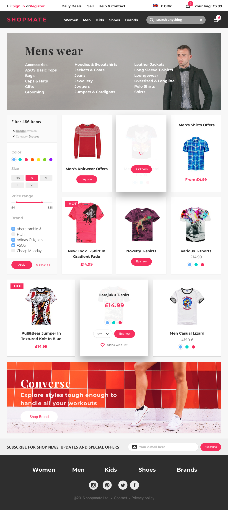

# Turing challenge.

---

## Features

- [x] Users can view all items when entering the website 
- [ ] Items are displayed properly based on the selected department and category 
- [ ] Users can search items through search box
       
- [ ] Support paging if we have too many items 
- [ ] Users can see item details by selecting a specific item 
- [ ] Users can add items to their shopping carts 
- [ ] Users can register/login using website custom forms, or social login libraries 
- [ ] Users can update personal profiles with shipping addresses and other info 
- [ ] Users can checkout with 3rd party payment gateways: Stripe.

## Used Architecture/Technologies

React 
React-Router 
Redux 
Redux-thunk 
Axios 
Sass 

### `npm start`

Runs the app in the development mode. 
Open [http://localhost:3000](http://localhost:3000) to view it in the browser.

---
